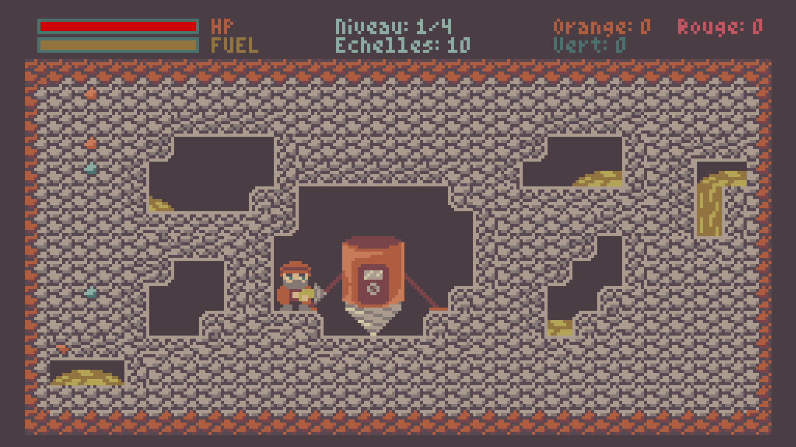
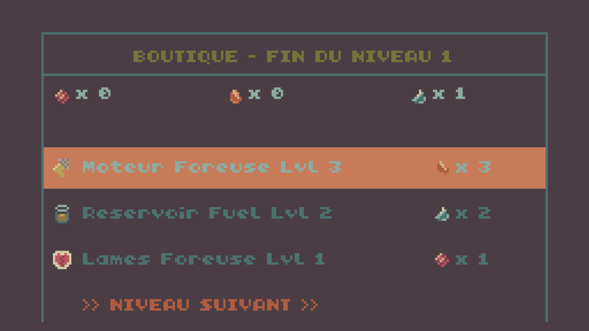

***

# 🧀 Expédition Félicien

**Expédition Félicien** est un jeu d'action/exploration rétro développé pour la console virtuelle **TIC-80**. Incarnez Félicien dans une aventure souterraine épique où le minage, la gestion des ressources et le combat se mêlent à une quête ancestrale unique.

---

## 📜 Le Lore
Depuis des générations, la légende raconte l'existence d'un trésor gastronomique perdu dans les profondeurs les plus reculées de la terre : **le dernier Saint-Félicien**. 

Félicien, dernier descendant d'une lignée de maîtres affineurs-mineurs, s'enfonce dans les abysses avec sa foreuse géante. Son objectif ? Récupérer le Fromage de ses ancêtres pour restaurer l'honneur de sa famille. Mais attention, les profondeurs sont gardées par des créatures hostiles qui n'ont pas l'intention de partager une miette.

---

## 🎮 Caractéristiques du Jeu

* **Progression par Niveaux :** Traversez 4 zones distinctes, chacune plus profonde et dangereuse que la précédente.
* **Minage Stratégique :** Collectez des minerais précieux (Orange, Vert, et le rare Rouge à partir du niveau 2) pour améliorer votre équipement.
* **Système de Foreuse Géante :** Votre vaisseau (5x4 tuiles) est votre seul refuge. Nettoyez la zone de ses minerais pour débloquer la porte et passer au niveau suivant.
* **Boutique d'Améliorations (Shop) :** Entre chaque niveau, dépensez vos ressources pour booster votre moteur, votre réservoir de fuel ou la puissance de vos lames.
* **Difficulté Progressive :** À partir du niveau 3, les monstres deviennent plus robustes et infligent deux fois plus de dégâts.
* **L'Objectif Final :** Trouvez et ramassez l'artefact **Saint-Félicien** au cœur du niveau 4 pour remporter la victoire !

---

## ⌨️ Commandes

| Touche | Action |
| :--- | :--- |
| **Flèches** | Se déplacer / Miner dans une direction |
| **Espace (A sur TIC)** | Sauter / Jouer / Valider dans le shop |
| **A (B sur TIC)** | Poser une échelle |
| **R** | Recommencer la partie (Game Over / Menu) |

---

## 🛠️ Fiche Technique

* **Console :** TIC-80
* **Langage :** Fennel (Lisp compilé en Lua)
* **Équipe de développement :** **BecVerresoeur**
* **Moteur de rendu :** Tile-based mapping avec gestion d'offset Y dynamique.

---

## 🚀 Installation et Lancement

1.  Téléchargez ou ouvrez [TIC-80](https://tic80.com/).
2.  Copiez le code source du fichier `.fnl`.
3.  Dans la console TIC-80, tapez `fennel` pour passer en mode Fennel (si nécessaire) ou collez directement dans l'éditeur de code.
4.  Tapez `run` pour lancer l'expédition !

---

## 📷 Captures d'écran

*© 2026 - Équipe BecVerresoeur. Pour la gloire du fromage.*
