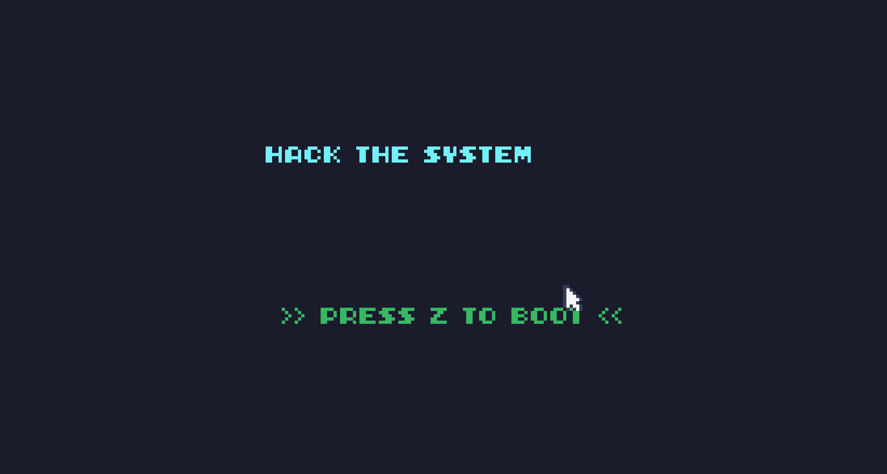
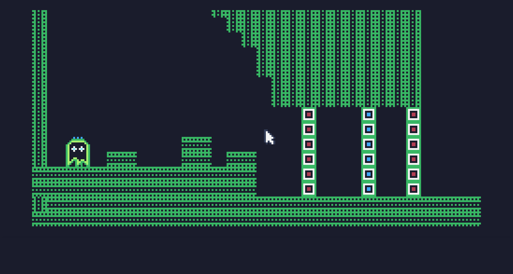

# 24 H pour coder 

## HACK THE SYSTEM
### Un plateformer 2D dans lequel un virus doit s'infiltrer dans une machine et extraire des données 
## Check-list : 
- [x] Écran démarrage
- [x] Gravité
- [x] Readme approximatif 
- [ ] SFX
- [x] Level Design
- [ ] Boss
- [x] Graphismes
- [x] Écran GameOver ~~A moitié~~ 

#### Écran de démarrage :

### Capture d'écran dans le jeu 

