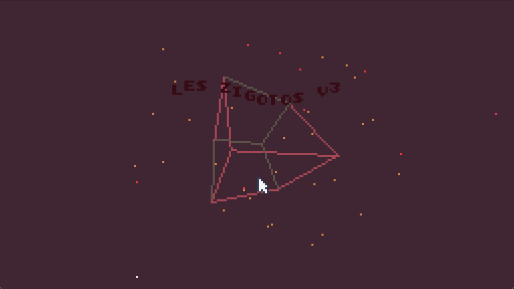
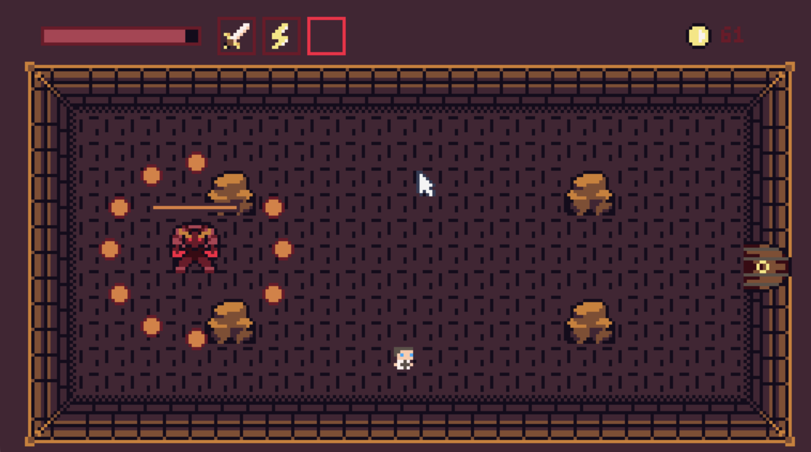

# Les Zigotos V3

Un roguelike d'action rapide: salle après salle, choisissez vos récompenses, améliorez votre style de jeu et survivez jusqu'au boss.

## Principe du jeu

Vous incarnez un aventurier qui traverse une série de salles remplies d'ennemis.

La progression suit une boucle simple:

- 4 salles de combat
- 1 boutique pour vous soigner ou vous renforcer
- 1 salle de boss

Après chaque combat gagné, vous obtenez une carte de récompense pour personnaliser votre partie (attaque, sort ou utilitaire). Le but est de tenir le plus longtemps possible en enchaînant les cycles.

## Lancer le projet

1. Installez [TIC-80](https://tic80.com/create).
2. Ouvrez un terminal à la racine du projet.
3. Lancez le jeu avec:

```bash
tic80 --skip --fs . --cmd="load assets/game.tic & import code src/main.fnl & run"
```

Si vous êtes déjà dans la console TIC-80, vous pouvez aussi lancer:

```text
load assets/game.tic
import code src/main.fnl
run
```

## Comment jouer

- Déplacement: flèches directionnelles
- Attaque principale: `E`
- Sort: `A`
- Action/validation (menu, récompenses, achats): `X` (ou bouton A de la manette TIC-80)
- Utilitaire: `Z`

Objectif: nettoyer les salles, récupérer des récompenses, passer par la boutique au bon moment et vaincre le boss.

## Captures d'écran


_Légende: écran d'accueil du jeu._


_Légende: affrontement dans une salle de combat avec plusieurs ennemis._


_Légende: passage en boutique ou rencontre avec le boss._

## État du projet

Version jouable avec boucle complète combat -> boutique -> boss, écrans de menu et game over, système de récompenses, et plusieurs types d'ennemis.

## Crédits

Projet réalisé par l'équipe **Les Zigotos V3** dans le cadre du hackathon *24h pour coder 2026*.
